# TACOMAX - Trajectory And Confinement Of Magnetized Adiabatic eXcursions
TACOMAX is a physics simulation for modeling the trajectory and confinement of charged particles under various magnetic field conditions. It is currently being built in multiple milestones that map to the history of fusion confinement concepts.

## Milestone 1 - Magnetic Mirrors
Magnetic mirrors were one of the earliest fusion confinement concepts. They attempt to confine particles by reflecting them between two high strength coils. These machines fail because of the loss cone -- a region in velocity space from which particles inevitably escape the mirror. This milestone visualizes the loss cone, and quantifies how mirror ratio affects the confinement ability of a magnetic mirror.

### Physics
governing equations to be populated

### Simulation Approach
to be populated

### Results
Below is a plot of a single particle trajectory. The left subplot shows the trajectory in 3D space, where is traces a helical path as it bounces between the mirror coils (located at z = ±1 m). The right subplot shows the z position of the particle as a function of time. This plot shows a strong oscillatory motion as the particle is confined and reflected in the magnetic mirror.

Below are plots showing the loss cone for mirror ratios of 1.5, 2, 3, 5, and 10. Each plot shows escaped vs reflected particles as a function of pitch angle ($\theta$). The step in simulation outcome being located very close to the analytic critical pitch angle ($\theta_c$) confirms the simulation is correctly identifying the loss cone boundary. The error in critical pitch angle can be seen at the top of each plot, with the max error being 1.3% for $R_m$ = 10. The sequence of plots also shows that the critical pitch angle decreases as the mirror ratio increases. This visualizes how confinement improves at higher mirror ratios, albiet with diminishing returns.

$R_m$ = 1.5:
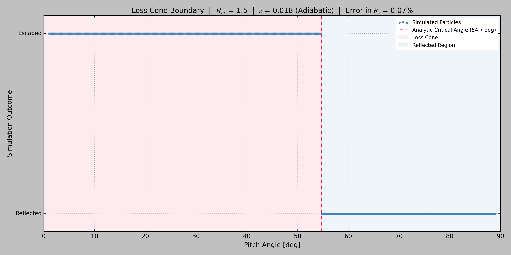

$R_m$ = 2:
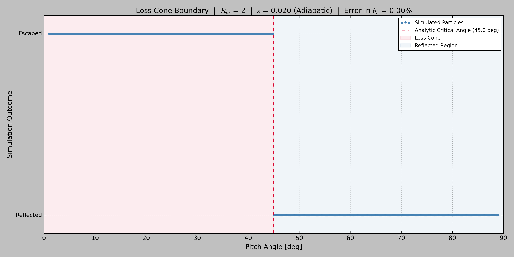

$R_m$ = 3:
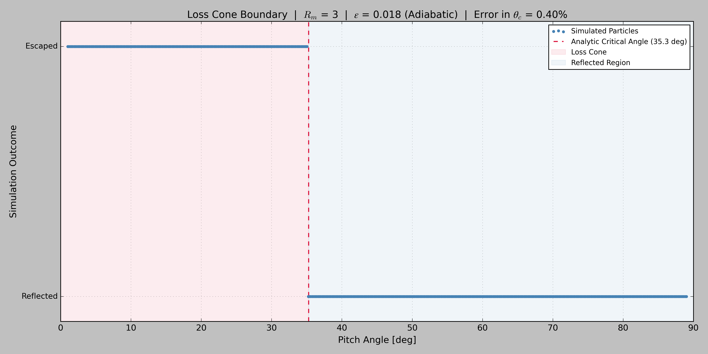

$R_m$ = 5:
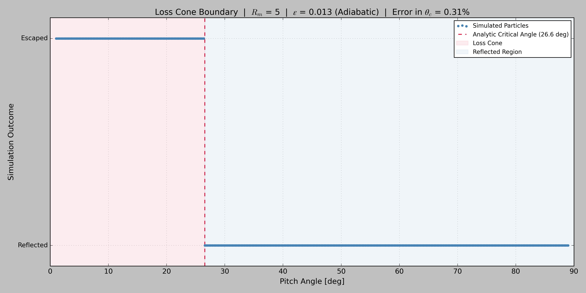

$R_m$ = 10:
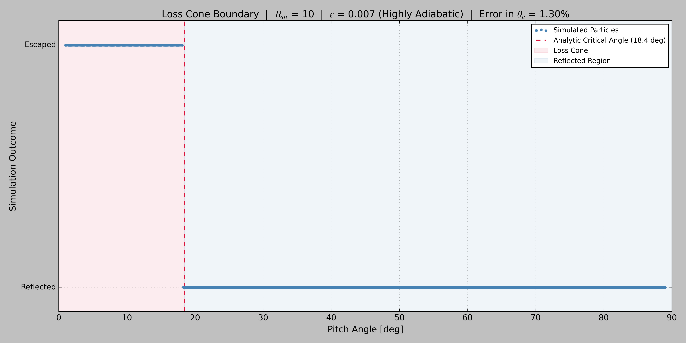

Below is a plot comparing the simulated and analytic critical pitch angles. Close agreement at the simulated mirror ratios further validates simulation accuracy. This plot is also a good visualization of improved confinement at higher mirror ratios.
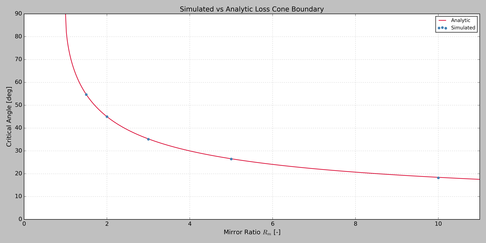

### Validation
to be populated

### Limitations
to be populated

## Milestone 2 - Toroidal and Poloidal Fields

### Physics
A toroidal magnetic field has magnitude that scales inversely with radial position. The magnitude at a given radius can be found by:

$B_{{tor}} = \frac{B_0R_0}{R}$

This can then be projected into Cartesian coordinates such that:

$$\vec{B_{{tor}}} = \begin{bmatrix} B_{{tor,x}} \\ B_{{tor,y}} \\ B_{{tor,z}} \end{bmatrix} = \begin{bmatrix} B_{{tor}}(\frac{-y}{R}) \\ B_{{tor}}(\frac{x}{R}) \\ 0 \end{bmatrix}$$

The pure toroidal field guides particles circumferentially, but does not confine them vertically. This results in vertical drift, which is comprised of two components. The first is grad-B drift, which is drift that results from the magnetic field gradient. It is defined as:

$v_{{\nabla B}} = \frac{mv_{{\perp}}^2}{2qB_0R_0}$

The second source of drift is curvature drift, which results from the centrifugal force that particles experience when traveling along curved field lines. It is defined as:

$v_R = \frac{mv_{{\parallel}}^2}{qB_0R_0}$

These drifts can then be combined such that:

$v_{{drift}} = v_{{\nabla B}} + v_R$

In a pure toroidal field, these drifts act unconstrained which results in the particle drifting linearly. This drift is upward for a positvely charged particle, and downward for a negatively charged particle. This drift is a confinement failure of toroidal fields. In reality, this drift would cause particles to drift out of the bulk plasma and into the upper and lower surfaces of a tokamak.  
To counteract this, a poloidal field is added to the toroidal field. A poloidal field creates helical field lines parameterized by the safety factor. The safety factor is defined as the number of toroidal cycles a particle must complete before it completes one poloidal cycle. The poloidal field strength varies by the minor radial position of the particles and can be found by:

$r = \sqrt{(R - R_0)^2 + z^2}$ 
$B_{{pol}} = \frac{rB_{{tor}}}{R_0 q_{{safety}}}$

This can be projected into Cartesian coordinates such that:

$$\vec{B_{{pol}}} = \begin{bmatrix} B_{{pol,x}} \\ B_{{pol,y}} \\ B_{{pol,z}} \end{bmatrix} = \begin{bmatrix} B_{{pol}}(\frac{-z}{r})(\frac{x}{R}) \\ B_{{pol}}(\frac{-z}{r})(\frac{y}{R}) \\ B_{{pol}}(\frac{R - R_0}{r}) \end{bmatrix}$$

The combined magnetic field is:

$\vec{B} = \vec{B_{{tor}}} + \vec{B_{{pol}}}$

Particles following the helical field lines alternate passing through the outboard side (upward drift) and the inboard side (downward drift), cancelling the vertical drift over one poloidal cycle. Higher safety factors correspond to a weaker poloidal field, resulting in longer time between drift corrections, and larger total z excursion. Lower safety factors correspond to a stronger poloidal field and faster poloidal rotation, resulting in more frequent drift corrections. This limits total z excursion and results in better overall confinement. For this simulation, a safety factor of 2 was used. This means the particle will complete two toroidal cycles before it completes one poloidal cycle and its drift is corrected.

### Simulation Approach
to be populated

### Results
Below is a plot of a single particle trajectory in a toroidal field. The field can be seen to guide the particle circumferentially as it completes one toroidal transit, however, the particle drifts vertically unbounded. This is the confinement failure mode of pure toroidal fields. Positively charged particles (as shown below) drift upward and leave the bulk plasma and machine.
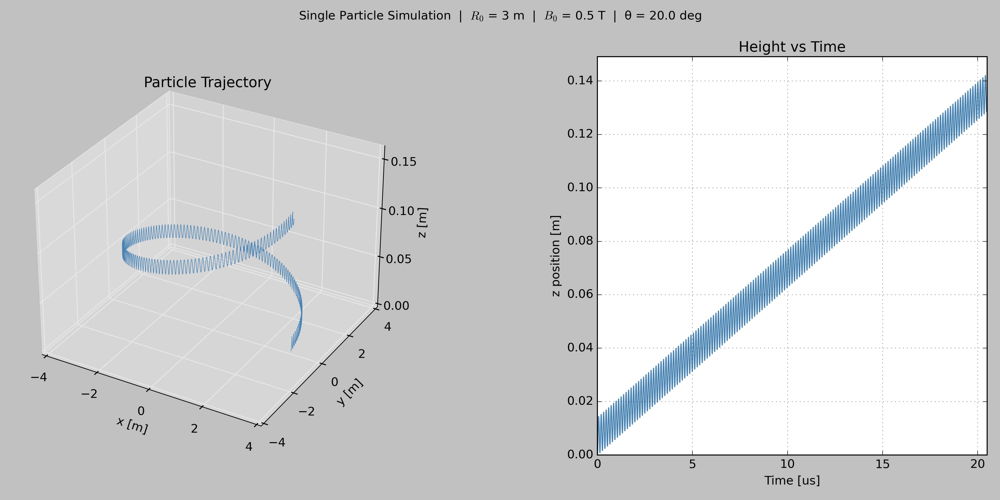

Below is a trajectory plot with a poloidal field added. In addition to a toroidal field, a poloidal field with safety factor of 2.0 has been implemented to counteract the vertical drift. In the z(t) plot to the right, sinusoidal oscillations in the z drift can be seen. By the end of the simulation, one poloidal cycle has been completed, and the z position has returned to its initial state. It can also be seen in the 3D trajectory plot that the particle finishes the poloidal cycle at its initial x and y positions.
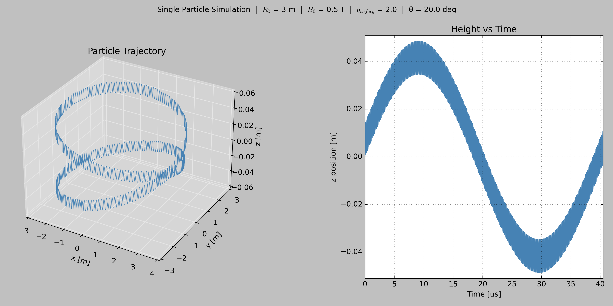

The plot below shows the z(t) subplot from the two plots above overlayed on the same axes. The blue plot is the unbounded linear drift of the pure toroidal field and the blue plot is the sinusiudal oscillating drift of the combined fields. It can be seen that the poloidal field suppresses the vertical drift and solves the confinement problems of the pure toroidal field.
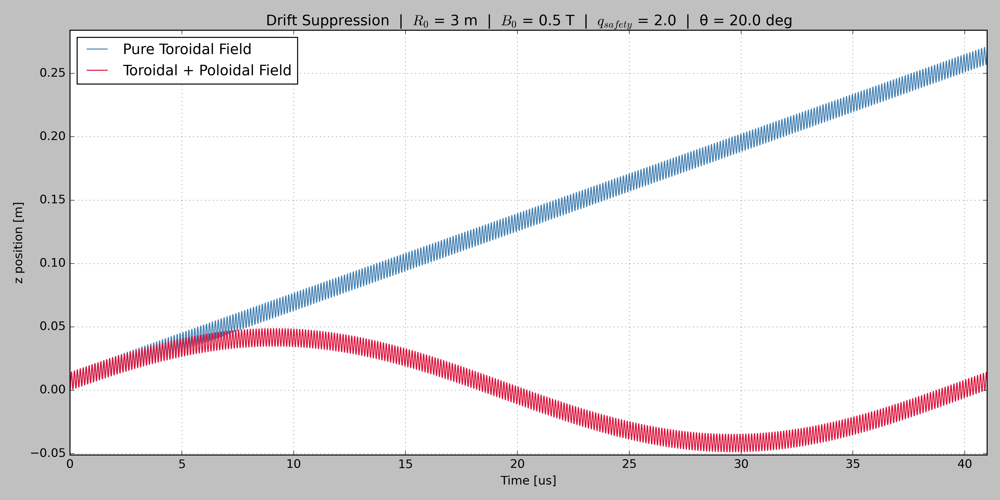

Below is a plot of drift rate vs pitch angle in a pure toroidal field. The simulated values (blue scatter) were validated against analytic predictions (red line) and showed very close agreement. The mean error was 0.040%, and the max error was 0.085% across the full range of pitches. This close agreement was achieved through implementing both grad-B and curvature drift in the analytic prediction. Earlier comparisons ignored curvature drift, resulting in high errors (>200%) at low pitch angles where curvature drift is the dominating drift source.
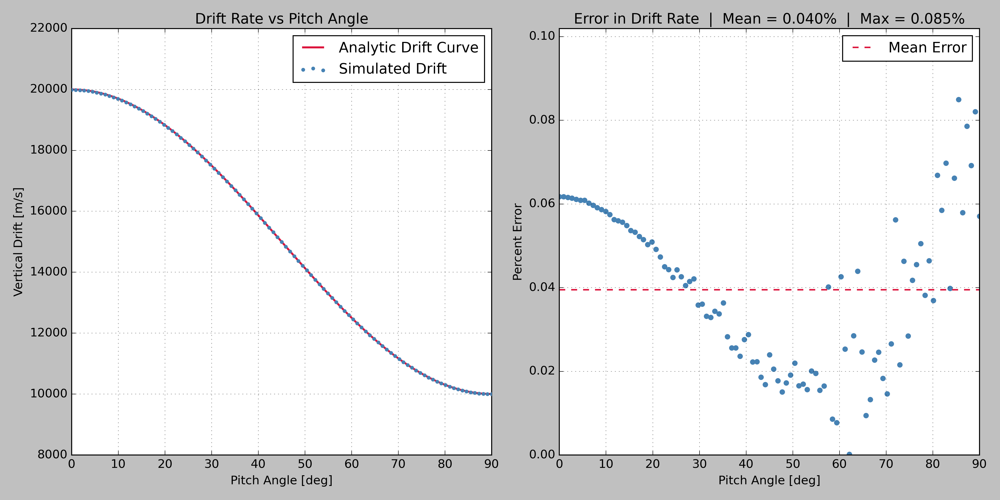

Below is a plot of z excursions over a safety factor sweep. The simulated z excursion scales linearly with safety factor, which is expected from analytic theory. The consistent offset above the analytic line is TO BE POPULATED
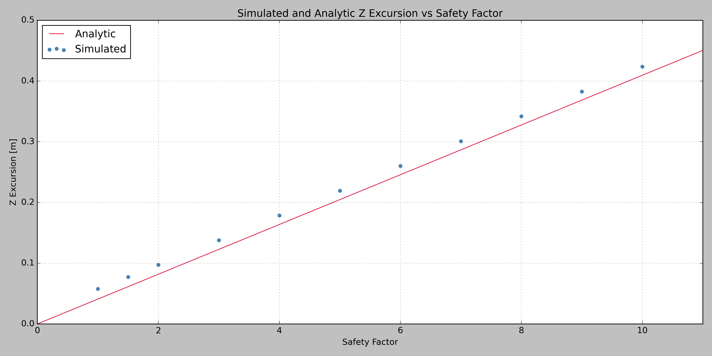

### Validation
Across a full pitch angle sweep, the simulation achieved a mean and maximum error of 0.040% and 0.085%, respectively. Linear z excursion scaling with safety factor was also confirmed across a sweep of factors from 1 to 10. ADD NOTE ABOUT LARMOR RADIUS CORRECTION FOR GRAD B DRIFT

### Limitations
to be populated
